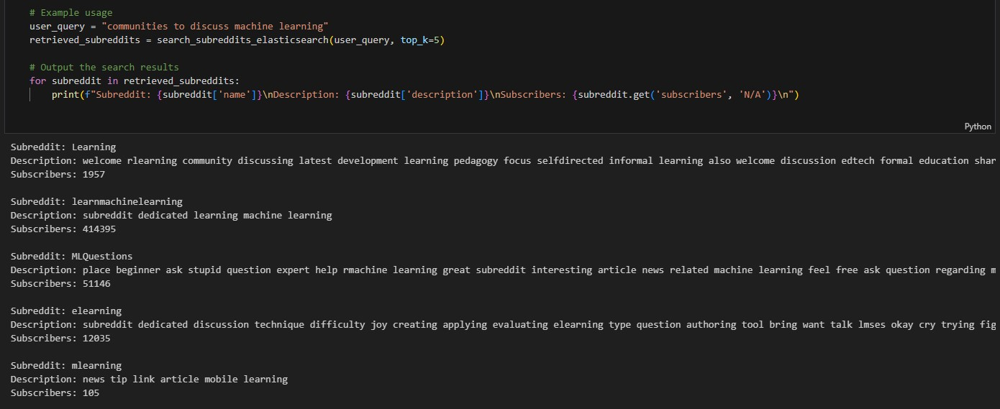
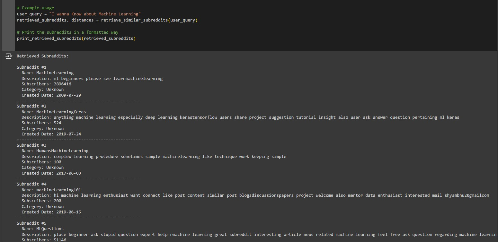
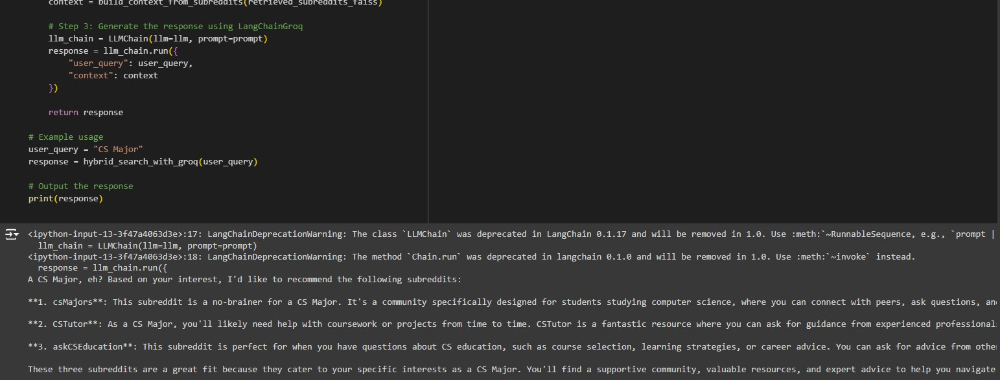

# SubReddit-Recommendation-System

# Reddit Recommendation System

This project is a Reddit-based recommendation system that scrapes subreddit data, processes it, and stores it in both Elasticsearch and a vector database (using FAISS) for querying. The system is designed to recommend subreddits or posts based on semantic similarity (using embeddings) and text-based relevance.

## Table of Contents

- [Overview](#overview)
- [Features](#features)
- [Technologies Used](#technologies-used)
- [Installation](#installation)
- [How to Run the Code](#how-to-run-the-code)

## Overview

The Reddit Recommendation System scrapes data from Reddit using the Reddit API and processes it to build a recommendation engine. The system stores the scraped data in Elasticsearch for efficient keyword-based querying and in FAISS for semantic similarity searches based on subreddit embeddings. This hybrid search mechanism allows for more precise and relevant subreddit recommendations based on user queries.

## Features

- Scrapes top communities and subreddits from Reddit.
- Fetches detailed subreddit information using Reddit's API.
- Processes and cleans subreddit data for recommendation.
- Stores data in an Elasticsearch index for efficient text-based searches.
- Builds and queries a FAISS-based vector database for semantic similarity searches.
- Combines results from FAISS and Elasticsearch to provide hybrid recommendations.
- Supports querying the recommendation system based on user inputs or specific subreddit characteristics.
- Integration with LangChain and Groq for natural language-based responses using retrieved subreddits as context.

## Technologies Used

- **Python**: Core programming language.
- **Reddit API**: To fetch subreddit data.
- **FAISS**: For creating and querying a vector database of subreddit embeddings.
- **Sentence-Transformers**: For generating subreddit embeddings.
- **Elasticsearch**: To store and search scraped data using text-based queries.
- **Pandas**: For data cleaning and preprocessing.
- **SQLite**: For intermediate data storage.
- **LangChain**: For language-based interactions using subreddit contexts.
- **BeautifulSoup**: For web scraping top subreddits.
- **requests**: For API requests.

## Installation

### Prerequisites

Make sure you have the following installed on your machine:

1. **Python 3.x**
2. **Elasticsearch** (for text-based search)
3. **FAISS** (for vector similarity search)
4. **Reddit API credentials** (client ID, client secret, user agent)

### Steps

1. Clone this repository:

   ```bash
   git clone https://github.com/yourusername/reddit-recommendation-system.git
   cd reddit-recommendation-system

2. Install the required dependencies:

    ```bash
    pip install -r requirements.txt
    ```

3. Set up your Reddit API credentials:

    - Create a `.env` file in the project root directory with the following details:

      ```bash
      CLIENT_ID=your_reddit_client_id
      CLIENT_SECRET=your_reddit_client_secret
      USER_AGENT=your_reddit_user_agent
      ```

4. Set up Elasticsearch:

    Install and configure Elasticsearch as needed for your environment. Update the Elasticsearch connection details in `elastic_search.py`.

5. Install FAISS:

    ```bash
    pip install faiss-gpu  # For GPU support
    ```

6. Ensure you have the SentenceTransformer model downloaded:

    ```bash
    pip install sentence-transformers
    ```

## How to Run the Code

Once the environment is set up, follow these steps to run the Reddit Recommendation System:

### 1. Scrape Subreddit Data

Firstly, I fetched the top subreddits from two websites:

- https://www.reddit.com/r/ListOfSubreddits/wiki/listofsubreddits/
- https://www.reddit.com/r/ListOfSubreddits/wiki/newtoreddit/

This step is handled in the `subreddittopcommunitiesscrapping.py` script. It scrapes the top subreddits from these websites using BeautifulSoup.

Next, use the following commands to scrape additional subreddit data from the Reddit API:

    ```bash
    python subreddittopcommunitiesscrapping.py
    python reddit_data_api_scrape.
    ```
### 2. Clean and Preprocess the Data

Cleans and preprocesses the scraped Reddit data to remove irrelevant or incomplete information. This step ensures that only high-quality data is indexed in Elasticsearch and FAISS:

    ```bash
    python data_cleaning.py
    ```

### 3. Populate Elasticsearch with Subreddit Data

Handles the interactions with Elasticsearch, creating the index and storing cleaned subreddit data for text-based searches. This allows the system to return recommendations based on keyword matches or other textual characteristics.

    ```bash
    python elastic_search.py
    ```

### 4. Build the FAISS Vector Index

The vectordb.py script generates subreddit embeddings using the SentenceTransformer models ('all-mpnet-base-v2' and 'all-MiniLM-L6-v2') to capture the semantic meaning of subreddit descriptions and top posts. These embeddings are indexed using FAISS for efficient similarity searches, enabling quick retrieval of semantically related subreddits. The script also saves the embeddings, FAISS index, and subreddit metadata for future use:

    ```bash
    python vectordb.py
    ```

### 5. Run the Recommendation System

    Handles the recommendation queries. Depending on the user query, it can either:
    - Retrieve subreddits based on vector similarity using FAISS.
    - Perform a hybrid search that combines both FAISS and Elasticsearch results for more accurate recommendations.:

    ```bash
    python subreddit_fetch.py
    ```

# Reddit Recommendation System

This project demonstrates three functionalities:

1. **Elasticsearch Retrieval**: Showcase how we retrieve subreddits using Elasticsearch for text-based queries.
2. **FAISS Vector Database Retrieval**: Showcase how we retrieve subreddits based on semantic similarity using FAISS vector search.
3. **LLM with RAG (Retrieval-Augmented Generation)**: Using a combination of FAISS and Elasticsearch for RAG to generate responses.

## Elasticsearch Retrieval

The following image shows the retrieval of subreddits based on a query using Elasticsearch:



## FAISS Vector Database Retrieval

This screenshot demonstrates retrieving subreddits using FAISS for semantic similarity:



## LLM with RAG (Using VectorDB and Elasticsearch)

This image demonstrates how the system combines FAISS and Elasticsearch using a Language Model for Retrieval-Augmented Generation (RAG):




